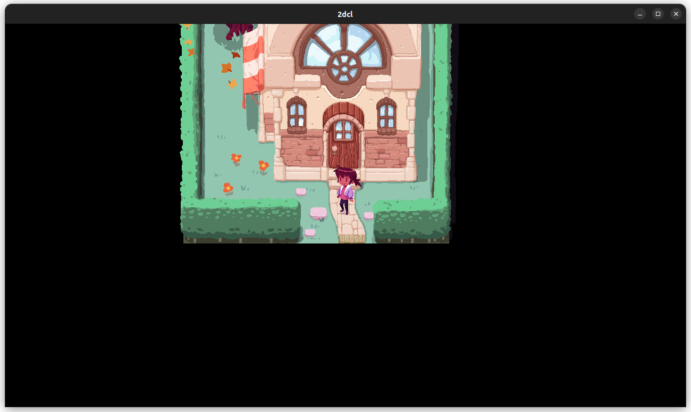
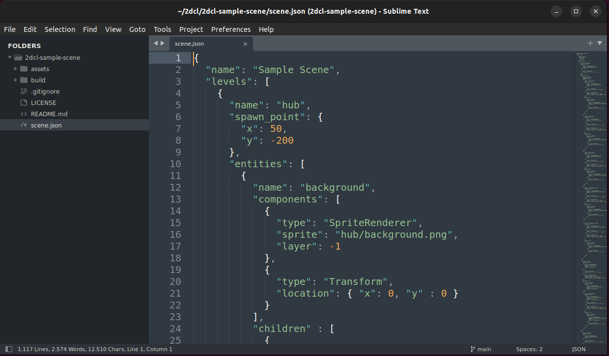
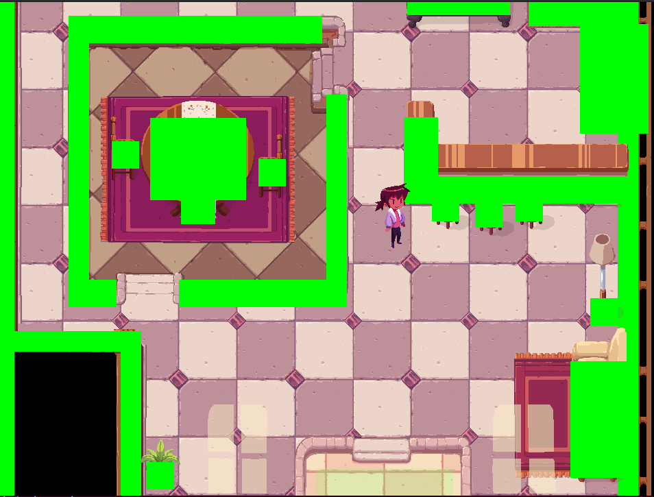

# Scene Creation (v 0.0.1)

This documents explains the process of creating a `2dcl` scene and uploading it to the catalyst network. At the moment the process is very manual and a bit laborious, but our hope is that we can continue working on the client and tools to make the process easier and more powerful.

That said, we made sure to eliminate as much friction out of the process as we could during the development of the client and protocol, and hopefully you'll find the current tools easy to use.

## Overview

The overall process is divided in three main steps:

 1. Creating a scene using a `scene.json`.
 2. Compiling the scene with our provided compiler.
 3. Uploading the scene using the `dcl` command.

## What knowledge do I need?

Since we're just starting with the project, our tools are a bit rough, that's why there's some knowledge you need to have to successfully deploy a scene:
  * A minimum level of terminal/console usage knowledge. Mainly how to move across directories and how to call programs in a terminal program. That can be the `Command Prompt` in Windows or `Terminal` in macOS or Linux.
  * Experience editing files, and with JSON formatting is also very helpful.
  * Familiarity with deploying scenes to Decentraland using the `dcl` SDK command.

## What do I need to download?

To start working on your scene you need to download the `2dcl` client from [https://2dcl.org](https://2dcl.org).

You'll find links to download the client for Windows, Linux and macOS in the homepage.

There you'll also find a link to the sample scene github repository, which you can fork if you're savvy with git, or you can download a zip containing the scene files.

In this guide I'll assume that you either added the `2dcl` command to your `PATH` or you know how to call the command wherever it is located. If you don't know how to do this, there are plenty of resources on the internet to learn this.

### Can I start from scratch?

Sure, if you don't want to deal with repositories or zip files, you just need to create a file called `scene.json` and a folder called `assets`.

The bare minimum content of `scene.json` is this:

```json
{
  "name": "The Name of My Scene",
  "parcels": ["0,0"],
  "base" : "0,0",
  "levels": [
    {
      ""
      "name": "Main Level",
      "entities": []
    },
    
  ]
}
```

The `assets` folder should have all the images you need to render your scene.

## Ok, now what?

The following steps will assume you have the sample scene, things will look differently if you started from scratch, but the overall process still applies.

The first thing to do is, when standing on the scene folder, call `2dcl preview`. 

You should see something like this in the terminal: 
```
~/2dcl-sample-scene$ 2dcl preview
2022-12-07T17:43:16.600995Z  INFO winit::platform_impl::platform::x11::window: Guessed window scale factor: 1    
2022-12-07T17:43:16.633674Z  INFO bevy_render::renderer: AdapterInfo { name: "NVIDIA GeForce RTX 3080 Ti", vendor: 4318, device: 8712, device_type: DiscreteGpu, backend: Vulkan }
```

And you should see a new window open up.



The `preview` mode for `2dcl` will listen for changes in `scene.json` and reload the scene automatically.

## Editing `scene.json`

The first thing you want to do is to open `scene.json` in a text editor.



Here you can start modifying the definition for your scene.

To understand the format, options and components available, please refer to the [RFC-1](https://github.com/2dcl/2dcl/blob/main/docs/RFC-1.md).

## Useful Features in Previewer

### Recompile

If you hit `R`, your scene will be recompiled and reloaded in the preview window.

### Collider Debugging

If you hit `C` you'll see all the colliders on screen.



### Level switching

If you hit a number from `1` to `0` you'll jump to that level.

`1` is always the hub, and `2` to `0` are the subsequent levels (from `2` to `10`). We don't have a way to access levels higher than `10` at the moment, you can edit them by adding a `LevelChange` component on an object or moving them on the json to a level you can jump to and then moving it back to the right position, sorry.

## Deploying a Scene

Once you're happy with your scene, you can run `2dcl build`.

You can now copy the contents of the build folder to a folder called `2dcl` wherever you have the existing code for the 3d version of the scene and then call:

`dcl deploy --skip-build --skip-version-checks`

You'll have to sign the deployment and if everything goes according to plan, you should have your land on 2dcl! Congrats! 

Make sure to let us know on Discord if you deployed a land for everyone to check it out :)

